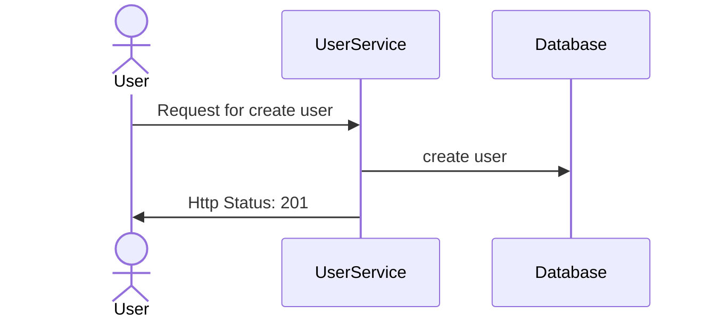
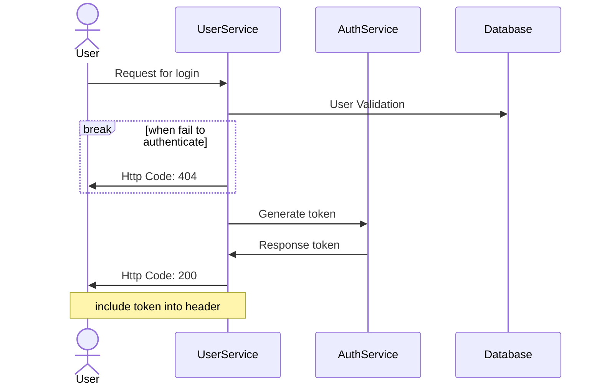
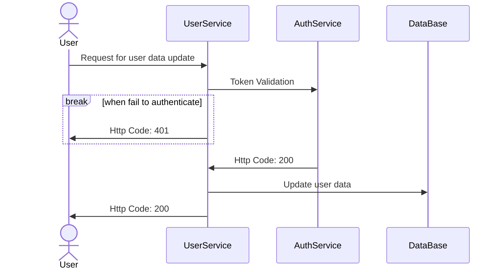
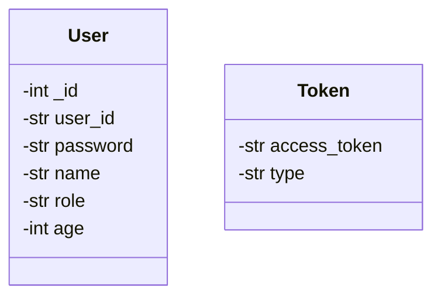

# Structure

## Service Flow

### First user create request

```mermaid
sequenceDiagram
    actor User
    participant UserService
    participant Database

    User ->> UserService: Request for create user
    UserService ->> Database: create user
    UserService ->> User: Http Status: 201
```

### Login

```mermaid
sequenceDiagram
    actor User
    participant UserService
    participant AuthService
    participant Database

    User ->> UserService: Request for login
    UserService ->> Database: User Validation
    break when fail to authenticate
        UserService ->> User: Http Code: 404
    end
    UserService ->> AuthService: Generate token
    AuthService ->> UserService: Response token
    UserService ->> User: Http Code: 200
    Note over UserService,User: include token into header
```

### Request for user data update

```mermaid
sequenceDiagram
    actor User
    participant UserService
    participant AuthService
    participant DataBase

    User ->> UserService: Request for user data update
    UserService ->> AuthService: Token Validation
    break when fail to authenticate
        UserService ->> User: Http Code: 401
    end
    AuthService ->> UserService: Http Code: 200
    UserService ->> DataBase: Update user data
    UserService ->> User: Http Code: 200
```

## Data

```mermaid
classDiagram
    class User {
        -int _id
        -str user_id
        -str password
        -str name
        -str role
        -int age
    }
    class Token {
        -str access_token
        -str type
    }
```
